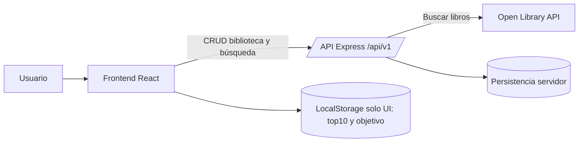

# Arquitectura de Readink

## Componentes principales

- **Navbar** — navegación entre páginas
- **BookCard** — tarjeta de cada libro (portada, título, autor, estado)
- **BookList** — lista de libros por sección
- **SearchBar / AddBookForm** — buscador conectado a Open Library vía backend
- **StarRating** — valoración de 1 a 5 estrellas (solo en "Leídos")
- **NoteModal** — modal para escribir notas personales
- **StatusBadge** — etiqueta de estado del libro
- **StatsPanel** — estadísticas del usuario

## Componentes reutilizables

BookCard, StarRating, StatusBadge y NoteModal son reutilizables
en distintas páginas de la aplicación.

## Gestión del estado

- **Context API** → lista global de libros guardados del usuario
- **useState** → estado local de formularios, modales y búsqueda
- **useEffect** → llamadas a la API al cargar componentes

## Endpoints REST

| Método | Ruta               | Descripción                        |
|--------|--------------------|------------------------------------|
| GET    | /api/v1/books      | Obtener todos los libros guardados |
| POST   | /api/v1/books      | Añadir un libro a una lista        |
| PATCH  | /api/v1/books/:id  | Editar lista, nota o valoración    |
| DELETE | /api/v1/books/:id  | Eliminar un libro                  |
| GET    | /api/v1/openlibrary/search?q=... | Buscar libros en Open Library (normalizado y filtrado por español) |

## Persistencia de datos

| Dato                        | Dónde          |
|-----------------------------|----------------|
| Libros guardados            | Backend (API /books) |
| Resultados de búsqueda Open Library | Backend (API /openlibrary/search) |
| Top 10 y objetivo anual     | LocalStorage (temporal) |
| Estado de modales           | Solo cliente    |

## Flujo de datos

Usuario → Frontend (React) → API Client (`src/api/client.ts`) → Backend (Express)
Backend → Open Library API (proxy de búsqueda y filtro de idioma español)

## Diagrama de flujo de datos

La biblioteca usa backend como fuente de verdad (`/api/v1/books`).
La búsqueda de Open Library también pasa por backend (`/api/v1/openlibrary/search`).
En frontend, LocalStorage se usa solo para datos de UI temporal (`top10` y `objetivo anual`).

## Notas de UX actuales

- En `Explorar`, las tarjetas muestran portada cuando existe `coverUrl`.
- Si un libro no tiene portada, se muestra fallback visual premium.
- Las secciones de explorar incluyen botón `+ Ver más` para cargar más recomendaciones.