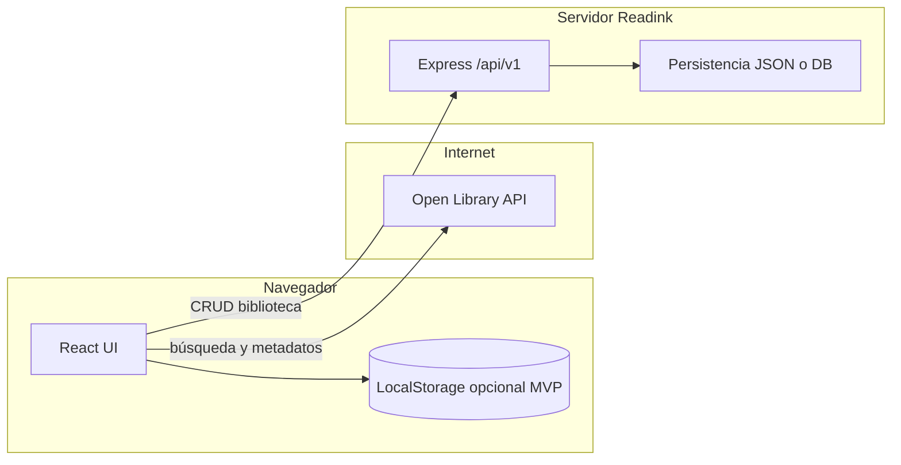
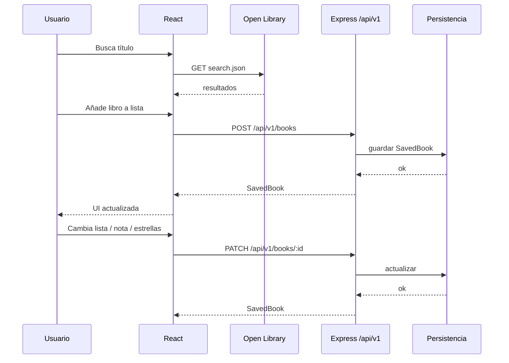

# Readink — Arquitectura y diseño

Este documento fija las decisiones de **arquitectura frontend**, **gestión de estado**, **API REST versionada** y **persistencia** (cliente vs servidor). Está alineado con [idea.md](idea.md).

---

## 1. Vista general

- **Cliente (Vite + React):** rutas, UI, llamadas a Open Library para búsqueda/metadatos y, si está activo, al backend Readink para la biblioteca del usuario.
- **Backend (Express):** API REST bajo prefijo **`/api/v1`**; persiste entradas de biblioteca (sin sustituir a Open Library como fuente de verdad de catálogo mundial).



---

## 2. Estructura de componentes principales

### Páginas (`src/pages/`)

| Página | Responsabilidad |
|--------|-----------------|
| **Home** o **Library** | Vista principal: tres columnas o listas (Quiero leer / Leyendo / Leídos) y acceso a búsqueda. |
| **Search** | Búsqueda en Open Library, resultados, acción “añadir a lista”. |
| **BookDetail** | Detalle de un libro (portada, autor, año, sinopsis) + notas y valoración si ya está en biblioteca. |

Las rutas pueden ser por ejemplo: `/`, `/search`, `/book/:workKey` (o id interno según modelo).

### Componentes de dominio (`src/components/`)

| Componente | Rol |
|------------|-----|
| **Layout** | Cabecera, navegación, contenedor común (envuelve páginas). |
| **LibraryBoard** | Orquesta las tres listas y el flujo de arrastrar/mover entre estados. |
| **ListColumn** | Una columna: título, lista de tarjetas, vacío. |
| **BookCard** | Resumen de un libro en lista (portada, título, autor, acciones). |
| **BookDetailPanel** | Bloque de ficha ampliada (reutilizable en página detalle o modal). |
| **SearchBar** | Input + envío de búsqueda (controlado desde página Search). |
| **SearchResults** | Lista de resultados de Open Library. |
| **StarRating** | Valoración 1–5 estrellas (solo lectura o editable según props). |
| **NoteEditor** | Textarea o campo para notas por libro. |
| **EmptyState** | Mensaje cuando una lista no tiene ítems. |
| **ErrorMessage** / **LoadingSpinner** | Feedback de error y carga (genéricos). |

---

## 3. Componentes reutilizables

Se consideran **reutilizables** (props claras, sin acoplar a una sola página):

- **Layout**, **BookCard**, **ListColumn**, **StarRating**, **NoteEditor**, **EmptyState**, **LoadingSpinner**, **ErrorMessage**, **SearchBar** (si se usa también en filtros internos más adelante).
- Piezas UI puras: **Button**, **Modal**, **Input** (si se extraen de páginas).

**Menos reutilizables** (más acopladas al flujo): **LibraryBoard**, **SearchResults** (pueden seguir en `components/` pero con más lógica de página).

---

## 4. Gestión del estado

| Capa | Qué guarda |
|------|------------|
| **React Context** (`src/context/`, p. ej. `LibraryContext`) | Biblioteca del usuario: lista de entradas de libro, operaciones “añadir”, “mover de lista”, “actualizar nota/valoración”, “eliminar”. Implementación recomendada: **`useReducer` + Context** para predecibilidad, o un único estado con funciones exportadas. |
| **Estado local (`useState`)** | UI: modal abierto/cerrado, texto de búsqueda antes de enviar, pestañas. |
| **Datos remotos** | Resultados de Open Library: estado local en página Search o hook `useOpenLibrarySearch`; no hace falta Context global salvo caché explícita. |
| **React Router** | URL como fuente de verdad para **ruta** y **ids en la URL** (detalle de libro). |

**Alternativa futura:** si el estado crece mucho, **Zustand** u otra store ligera; no es obligatorio en el MVP.

**Sincronización backend:** el Context (o capa `services/`) llamará a `src/api/client.ts` para persistir en servidor cuando exista backend; en MVP solo cliente, el mismo reducer puede hidratarse desde **LocalStorage** al iniciar y guardar en cada cambio.

---

## 5. API REST — recurso principal `books`

Prefijo: **`/api/v1`**. Formato de cuerpo y respuestas: **JSON**, `Content-Type: application/json`. Errores: objeto con `message` (y opcionalmente `code`).

### 5.1 Modelo de datos (contrato)

**`ReadingList`** (enum string):

- `WISHLIST` — Quiero leer  
- `READING` — Leyendo  
- `READ` — Leídos  

**`SavedBook`** (recurso persistido en servidor):

```ts
// Contrato lógico; los nombres exactos pueden coincidir con src/types/
{
  "id": "uuid-v4",
  "workKey": "/works/OL45883W",     // identificador estable Open Library (work)
  "title": "string",
  "authorNames": ["string"],
  "coverId": 123456,                 // opcional; Open Library cover id
  "firstPublishYear": 1997,        // opcional
  "list": "WISHLIST" | "READING" | "READ",
  "note": "string | null",
  "rating": 1 | 2 | 3 | 4 | 5 | null,  // típicamente solo READ; validar en servicio
  "createdAt": "ISO-8601",
  "updatedAt": "ISO-8601"
}
```

Los campos **denormalizados** (`title`, `authorNames`, `coverId`…) evitan depender de Open Library en cada lectura; se pueden refrescar con una acción futura “sincronizar metadatos”.

### 5.2 Endpoints

| Método | Ruta | Descripción |
|--------|------|-------------|
| `GET` | `/api/v1/health` | Comprobación de servicio (opcional pero útil en despliegue). |
| `GET` | `/api/v1/books` | Lista todas las entradas guardadas del usuario (en MVP sin auth: “único usuario implícito”). |
| `GET` | `/api/v1/books/:id` | Detalle de una entrada por `id`. |
| `POST` | `/api/v1/books` | Crea una entrada (libro añadido a una lista). |
| `PATCH` | `/api/v1/books/:id` | Actualiza `list`, `note`, `rating` y/o snapshot de metadatos permitidos. |
| `DELETE` | `/api/v1/books/:id` | Elimina la entrada. |

#### `POST /api/v1/books` — cuerpo de entrada

```json
{
  "workKey": "/works/OL45883W",
  "title": "string",
  "authorNames": ["string"],
  "coverId": 123456,
  "firstPublishYear": 1997,
  "list": "WISHLIST",
  "note": null,
  "rating": null
}
```

**Respuesta:** `201 Created` con el objeto **`SavedBook`** completo (incluye `id` generado y fechas).

#### `PATCH /api/v1/books/:id` — cuerpo parcial

```json
{
  "list": "READ",
  "note": "Me ha encantado el final.",
  "rating": 5
}
```

**Respuesta:** `200 OK` con **`SavedBook`** actualizado.

#### `GET /api/v1/books`

**Respuesta:** `200 OK`

```json
{
  "data": [ /* SavedBook[] */ ]
}
```

(O un array directo si se prefiere contrato mínimo; conviene documentar una sola convención y mantenerla.)

#### Errores

- `400` — validación (p. ej. `rating` en lista no READ).  
- `404` — `id` inexistente.  
- `500` — error interno.

---

## 6. Qué se persiste en servidor vs solo en cliente

| Dato | Servidor (API Readink) | Solo cliente |
|------|-------------------------|--------------|
| Entradas de biblioteca (`SavedBook`) | Sí, cuando el backend está activo | En MVP sin backend: **LocalStorage** (misma forma lógica que el contrato anterior). |
| Resultados de búsqueda Open Library | No (efímeros) | Memoria de la sesión / estado React. |
| Preferencias UI (modo oscuro, filtros de vista) | No en MVP | **localStorage** o `prefers-color-scheme`. |
| Caché de portadas / metadatos | Opcional más adelante | Navegador / CDN de Open Library. |

Regla práctica: **la biblioteca del usuario** es lo que debe poder **migrar** de LocalStorage al servidor con el mismo modelo `SavedBook`.

---

## 7. Flujo de datos (lectura / escritura)



Sin backend: las flechas a **API** y **DB** se sustituyen por lectura/escritura en **LocalStorage** desde el mismo Context/servicio, manteniendo los tipos alineados con `SavedBook`.

---

## 8. Decisiones resumidas

| Decisión | Elección |
|----------|----------|
| Versionado API | `/api/v1` |
| Estado global de biblioteca | Context + `useReducer` (o store ligera más adelante) |
| Metadatos de catálogo | Open Library en cliente; snapshot en `SavedBook` en servidor |
| MVP sin servidor | LocalStorage + mismos tipos que la API |
| Componentes compartidos | Tarjetas, listas, valoración, layout, estados vacíos/carga/error |

Este documento puede actualizarse cuando se añadan **autenticación**, **multiusuario** o **base de datos real**; los contratos deberían evolucionar con versión (`v2`) si hay cambios incompatibles.
