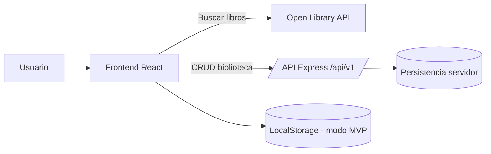

# Arquitectura de Readink

## Componentes principales

- **Navbar** — navegación entre páginas
- **BookCard** — tarjeta de cada libro (portada, título, autor, estado)
- **BookList** — lista de libros por sección
- **SearchBar** — buscador conectado a Open Library API
- **StarRating** — valoración de 1 a 5 estrellas (solo en "Leídos")
- **NoteModal** — modal para escribir notas personales
- **StatusBadge** — etiqueta de estado del libro
- **StatsPanel** — estadísticas del usuario

## Componentes reutilizables

BookCard, StarRating, StatusBadge y NoteModal son reutilizables
en distintas páginas de la aplicación.

## Gestión del estado

- **Context API** → lista global de libros guardados del usuario
- **useState** → estado local de formularios, modales y búsqueda
- **useEffect** → llamadas a la API al cargar componentes

## Endpoints REST

| Método | Ruta               | Descripción                        |
|--------|--------------------|------------------------------------|
| GET    | /api/v1/books      | Obtener todos los libros guardados |
| POST   | /api/v1/books      | Añadir un libro a una lista        |
| PATCH  | /api/v1/books/:id  | Editar lista, nota o valoración    |
| DELETE | /api/v1/books/:id  | Eliminar un libro                  |

## Persistencia de datos

| Dato                        | Dónde          |
|-----------------------------|----------------|
| Libros guardados            | Backend         |
| Resultados de búsqueda      | Solo cliente    |
| Estado de modales           | Solo cliente    |

## Flujo de datos

Usuario → Frontend (React) → API Client (src/api/client.ts) → Backend (Express)
Frontend → Open Library API (búsqueda externa)

## Diagrama de flujo de datos

En modo MVP sin backend activo, el frontend usa LocalStorage.
Cuando el backend está activo, el frontend persiste la biblioteca vía `/api/v1/books`.